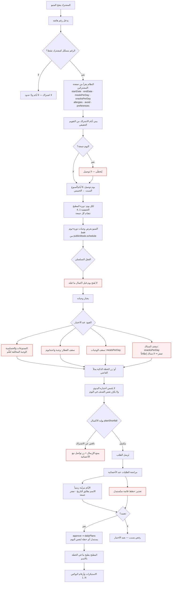

# منطق الخطط والجدولة — المرجع الكامل

> **الغرض:** لو حصل أي لخبطة في التواريخ أو الأيام أو الدورات، اقرأ هذا الملف أولاً.
> يشرح الآلية كاملةً: القاعدة، مصادرها الوحيدة، الأماكن الثلاثة، والأخطاء التي وقعت
> ولماذا. أي منطق جديد من هذا النوع يُضاف هنا بنفس الطريقة.

آخر تحديث: 2026-07-26. (يشمل: فلوشارت مسار المشترك كاملاً، ونتيجة فحص حيّ للقيود مع الثغرات المعروفة.)

---

## ١. القاعدة الأساسية (احفظها)

**التاريخ المكتوب على الخطة = يوم التوصيل. والاسم (السبت، الأحد…) يطابق التاريخ دائماً.**

- المشترك **لا يختار تاريخ بداية** — النظام يحدده من اشتراكه المسجَّل (`startDate`).
- النظام يبدأ من بداية الاشتراك ويمشي على **التقويم الحقيقي** يوماً بيوم.
- كل يوم يأخذ اسمَه الحقيقي (اليوم في التقويم) ووجباتِ (دورته الحقيقية، يومه الحقيقي).
- **الجمعة تُتخطّى دائماً** — لا توصيل فيها، فلا يقع عليها يوم أبداً.

مثال: مشترك بدايته **20 يوليو (اثنين)** → يبدأ بوجبات **الاثنين**، ثم 21 ثلاثاء،
22 أربعاء، 23 خميس، **يتخطّى الجمعة 24**، ثم 25 سبت… حتى ينتهي اشتراكه.

❌ **الخطأ:** أن يضع النظام «السبت» على تاريخ 20 (وهو اثنين). الاسم لا يطابق التاريخ.

### ⭐ الأساس الثلاثي — ما تفحصه دائماً لكل يوم خطة (احفظه جيداً)
صحّة الخطة **ليست التاريخ فقط**. لكل يوم لازم **الثلاثة معاً** تكون صح، وإلا المطبخ يطلع غلط:
1. **اليوم = التاريخ:** اسم اليوم يطابق يوم التاريخ في التقويم (لا سبت على اثنين).
2. **الدورة = دورة المطبخ:** رقم الدورة (1..4) في ذلك اليوم = الدورة التي المطبخ فعلاً
   عليها في ذلك التاريخ (تتقدّم كل جمعة). يُحسب بإشارة (ماضٍ ومستقبل) عبر
   `rotationWeekAtDate` — لا بالعدّ للأمام فقط.
3. **الوجبات = المطابِقة لـ(دورة+يوم) في المنيو:** الجدولة (`schedule[]`) تحكم **ماذا
   يَعرض المنيو** للعميل في كل (دورة+يوم) — يختار منها فقط. فيجب أن تكون وجبات الخطة
   هي المجدولة لـ(دورة ذلك اليوم + يومه)، حتى يبقى اليوم متّسقاً مع منيو ذلك اليوم.

> ✅ **كيف يعمل المطبخ فعلاً (تصحيح):** المطبخ (`Kitchen.tsx`) يقرأ خطط اليوم
> (`dailyPlans`) ويطبخ **بالضبط الوجبات المكتوبة في كل خطة** (`plan.items`، بالاسم
> المخزَّن على البند). فالمطبخ **يطبخ ما في الخطة أياً كان** — العميل يأخذ وجباته دائماً.
> لذلك **الجدولة تحكم الاختيار (المنيو) لا الطبخ**: وظيفتها أن العميل لا يختار إلا
> وجبات ذلك اليوم، فتكون خطط اليوم متجانسة (كل العملاء من منيو واحد). وجبة «خارج
> الجدول» في خطة قديمة **لا تعني مشتركاً بلا أكل** — المطبخ يطبخها بالاسم — بل تعني
> **خللاً في اتّساق البيانات** (طلب قديم أو سجل مكرر).

> ⚠️ **عند أي تعديل:** أصلِح التاريخ/اليوم/الدورة معاً، وتأكّد أن **المنيو** لا يَعرض
> إلا المجدول لكل (دورة+يوم). لا تكتفِ بإصلاح تاريخ وتترك المنيو يعرض وجبة يوم آخر.

**تحذير بيانات قائم:** بعض الوجبات كانت مكرّرة (نسخة مجدولة + نسخة بلا جدولة — المنيو
المزدوج)، وبعض الطلبات القديمة تشير للنسخة بلا جدولة، فتظهر «غير مجدولة لـ(دورة+يوم)».
سابق للتصحيح، ولا يكسر التوصيل (المطبخ يطبخ بالاسم). عولِج بتعطيل 49 نسخة مكررة
(2026-07-22)؛ الأمثل مستقبلاً ربط الطلبات القديمة بالسجل المجدول. راجع
[[adrenaline-menu-data-cleanup]].

---

## ⛔ كل القيود بوضوح (مرجع سريع — احفظه)

كل قيد أدناه **مصدره واحد** يسري على **المنيو اليدوي والخطة الذكية معاً**، ولا يكسر
غيره. عند إضافة أي قيد جديد: ضعه في المصدر الواحد ووثّقه هنا.

| # | القيد | القاعدة | المصدر الوحيد | يُطبَّق في |
|---|---|---|---|---|
| 1 | **يوم التوصيل = التاريخ** | اسم اليوم يطابق تاريخه؛ المشترك لا يختار البداية | `lib/subscription` (سلوتات) + `convex/lib/dates` | المنيو + الذكية + الاعتماد |
| 2 | **الجمعة إجازة** | لا توصيل يوم الجمعة أبداً؛ الخميس إجازة الطاقم؛ الجمعة يُطبَخ للسبت | `DELIVERY_DAY_NAMES` (يتخطّى الجمعة) | كل المسارات |
| 3 | **الأساس الثلاثي** | لكل يوم: (اليوم=التاريخ) + (الدورة=دورة المطبخ) + (الوجبات=المجدولة لـ(دورة+يوم)) | `slotToDate`/`rotationWeekAtDate` | المنيو + الاعتماد |
| 4 | **السقف اليومي** | كل يوم ≤ `mealsPerDay` رئيسية و≤ `snacksPerDay` سناك؛ لا تبديل سناك↔رئيسية، لا تجاوز | `isMainCategory`/`isSnackCategory` + سقوف المنيو | المنيو (السقف) + الذكية (`nMeals`/`nSnacks`) |
| 5 | **سقف الفطار** | فطار **واحد/يوم كحد أقصى** لكل الاشتراكات؛ الفطار رئيسية ويُحسب ضمن الإجمالي؛ الباقي غداء/عشاء (حد أعلى، لا يُلزِم بفطار) | `BREAKFAST_MAX_PER_DAY` + `isBreakfastCategory` في `mealSchedule.ts` | المنيو (الإضافة + الملء التلقائي) + `convex/ai.ts` (القواعد + نصّ الـAI) |
| 6 | **اكتمال الخطة** | لا إرسال حتى يُكمل العميل **كل أيام اشتراكه** (كل يوم مكتمل بالسقف)؛ يوم ناقص/غائب → «خطتك غير مكتملة» + المتبقّي + «أكمل وجباتك» + «تواصل مع الأخصائية» | `subscriptionShortfall(items, slots, mealsPerDay, snacksPerDay)` على `orderedSubscriptionSlots` | `OrderReview` (اليدوي) + `SmartPlan` (الذكي) |
| 7 | **الاشتراك الساري** | اشتراك منتهٍ (endDate في الماضي) → ممنوع الاختيار/التوليد؛ يُوجَّه للتجديد | `subscriptionState`/`isExpired` | المنيو + الذكية |
| 8 | **الممنوعات والحساسية** | لا تُعرَض/تُقترَح وجبة تخالف ممنوعات العميل (تحذير في اليدوي، حجب في الذكية) | `lib/mealRestrictions` (مرآة `ai.isBlocked`) | المنيو + الملء التلقائي + الذكية |
| 9 | **الخطة الذكية = اكتمال كامل صارم** | لمشترك معروف: وضع «اليوم» معطّل، عدد الأسابيع مقفول على **كامل الاشتراك المتبقّي**، والإرسال يمرّ ببوابة الاكتمال (#6) | `subWeeksRemaining` + `subscriptionShortfall` | `SmartPlan` |

**مبادئ حاكمة:**
- **مصدر واحد:** أي منطق للخطط/القيود في `client/src/lib/subscription.ts` أو `mealSchedule.ts`
  (واجهة) و`convex/lib/dates.ts` (خادم) — اليدوي والذكي يقرآن منه فلا يفترقان.
- **المطابقة بالرقم + الاسم:** العائلات تتشارك رقماً واحداً — طابِق بالاثنين.
- **لا تكسر قيداً قائماً:** أي قيد جديد يُضاف **فوق** الموجود بنفس الآلية، لا يبدّله.
- **تحقّق حيّاً:** لا تؤكّد سلامة قيد من الكود وحده — جرّبه على النظام الحيّ واذكر نطاقك.

### 🗂️ القنوات وإدارة الأصناف (مهم — كي لا تختلط)
كل الأصناف في جدول واحد **`publicMeals`** (المخزن الرئيسي)، وتُفصَل القنوات بعلامات:
| القناة | العلامة | تُدار من |
|---|---|---|
| منيو المشتركين | لا `isGymOnly` ولا `isOnlineOnly` + `schedule[]` | **إدارة المنيو العام** (`/public-meals-management`) — شبكة دورة×يوم |
| المنافذ/الكافيه | `isGymOnly` + صف في `outletCatalogItems` (سعر لكل منفذ) | مبيعات المنافذ ← **أصناف المنافذ** (تفعيل/سعر/إضافة) |
| الأونلاين | `isOnlineOnly` | قناة مستقلة |

- **العزل صارم:** فلاتر `publicMeals.ts` تستبعد `isGymOnly`/`isOnlineOnly` من منيو
  المشتركين، فلا يتسرّب صنف منفذ/أونلاين للعميل، ولا العكس. تعديل سعر منفذ يكتب في
  `outletCatalogItems` فقط (لا يمسّ `publicMeals.priceQAR` ولا المنافذ الأخرى).
- **الجدولة تُدار من الواجهة الآن** (كانت بسكربتات): «إدارة المنيو العام» تكتب `schedule[]`
  مباشرة (لا `weeks/days` القديمة). فإضافة/تعطيل/جدولة وجبة من الواجهة تتحكّم في المنيو الحي.
- خصم كل منفذ في `gymAccounts.discountPct`. الكافيه bulk بالجرام عبر `priceUnit`.
- **استيكرات المنافذ** (`/outlet-labels` · جدول `outletProductLabels`) قائمة **مستقلة**
  للطباعة الحرارية — غير مرتبطة بأسعار المنافذ (راجع [[adrenaline-outlet-labels-todo]]).

---

## ٢. أسبوع العمل والدورة

### أيام العمل
- **التوصيل: السبت → الخميس** (6 أيام).
- **الجمعة: لا توصيل** — لكنه **يوم عمل كامل**: المطبخ يطبخ فيه لتوصيل السبت.
- **الخميس: إجازة الموظفين** (شيء منفصل عن جدول التوصيل — يخصّ الحضور فقط).
- قاعدة الطبخ: **يوم الطبخ = يوم التوصيل − 1**.

| يطبخون | يوصّلون |
|---|---|
| الجمعة | السبت |
| السبت | الأحد |
| … | … |
| الأربعاء | الخميس |
| **الخميس (إجازة)** | (الجمعة: لا توصيل) |

### دورة المنيو (rotation)
- المنيو **4 أسابيع** (دورة 1، 2، 3، 4)، من ملف الإكسل: 4 أسابيع × 6 أيام × 9 وجبات.
- الدورة **تتقدّم +1 كل جمعة** (`crons.ts` → `advanceCookingWeek`).
- `restaurantSettings.currentCookingWeek` = دورة الطبخ الحالية.
- دورة أي تاريخ = `currentCookingWeek + عدد الجُمَع` بين اليوم والتاريخ (لفّ mod 4).

⚠️ **دورات المشترك قد تلفّ [2,3,4,1]** لو بدايته وسط الدورة — فالترتيب **زمني** لا برقم الدورة.

---

## ٣. المصادر الوحيدة (Single Source of Truth)

أي حساب للتواريخ/الأيام/الدورات **يجب** أن يمرّ على هذين الملفين. ممنوع تكراره في الصفحات.

### `convex/lib/dates.ts` (الخادم)
| الدالة | تفعل |
|---|---|
| `DELIVERY_DAYS` | السبت→الخميس (6 أيام). المصدر الوحيد لأيام التوصيل. |
| `isDeliveryDay(date)` | هل يوم توصيل؟ (الجمعة = لا). |
| `addDeliveryDays(from, n)` | يتقدّم n يوم توصيل (يتخطّى الجمعة). |
| `dayNameOf(iso)` | اسم اليوم لتاريخ (الجمعة → ""). |
| `fridaysBetween(a, b)` | عدد الجُمَع بإشارة (للماضي والمستقبل). |
| `rotationWeekAtDate(curWeek, anchor, target)` | دورة أي تاريخ. |

### `client/src/lib/subscription.ts` (الواجهة)
| الدالة | تفعل |
|---|---|
| `subscriptionState(endDate)` | حالة الاشتراك (ساري/منتهٍ). |
| `orderedSubscriptionSlots(start, end, startRot)` | **أيام الاشتراك مرتّبة زمنياً** — (دورة + يوم) لكل يوم توصيل، يتخطّى الجمعة. |
| `firstSubscriptionSlot(...)` | أول يوم للمشترك (نقطة انطلاق المنيو/الخطة). |
| `slotToDate(start, startRot, week, day)` | **تاريخ التوصيل** لـ(دورة+يوم): يمشي من ماكس(البداية، بكرة)، يتخطّى الجمعة. للتوصيل/الاعتماد — يقصّ عند بكرة. |
| `slotBlockDate(start, startRot, week, day)` | **تاريخ العرض** لـ(دورة+يوم): يمشي من **سبت الأسبوع** بلا قصّ. للمنيو فقط — يعطي كل يوم تاريخه الطبيعي في بلوكه (والمنيو يخفي ما قبل بكرة). |
| `planShortfall(items, mealsPerDay, snacksPerDay)` | **بوابة مطابقة الاشتراك**: لكل يوم مضمَّن في الطلب، كم وجبة رئيسية/سناك ناقصة عن الاشتراك. تصنيف مطابق للمنيو (`isMainCategory`/`isSnackCategory`)، والفئات غير المعروفة لا تُحسب. عددٌ غير مضبوط (0) ⇒ لا فحص. |

⚠️ **سقف الفطار — فطار واحد/يوم:** الفطار (breakfast) مسقوف عند `BREAKFAST_MAX_PER_DAY=1`
(في `mealSchedule.ts`) لكل الاشتراكات. الفطار **رئيسية** ويُحسب ضمن `mealsPerDay`، لكن بعد
اختيار فطار يُقفَل الفطار والباقي غداء/عشاء. حدٌّ أعلى فقط (لا يُلزِم بفطار). مطبَّق في:
**PublicMenu** (الإضافة + الملء التلقائي)، و**convex/ai.ts** (محرّك القواعد لا يكرّر الفطار
ولو `mealsPerDay>3`، ونصّ الـAI يمنعه). كل سلوت منيو فيه فطاران للاختيار — القيد يمنع أخذ
الاثنين. لا يغيّر إجمالي الوجبات ولا بوابة النقص.

⚠️ **بوابة اكتمال الخطة — صارمة (تأكيد الطلب):** العميل يجب أن يُكمل **كل أيام اشتراكه**
قبل الإرسال (كل يوم = `mealsPerDay` رئيسية + `snacksPerDay` سناك). يومٌ ناقص أو غائب →
**يُمنع الإرسال** ويُعرض المتبقّي + زر «أكمل وجباتك» (يرجع للمنيو) + «تواصل مع الأخصائية».
- **OrderReview (اليدوي):** `subscriptionShortfall(items, slots, mealsPerDay, snacksPerDay)`
  حيث `slots = orderedSubscriptionSlots(start, end, startRot)` و`startRot` من `rotationWeekAt`
  — **نفس سلوتات المنيو بالضبط** فلا يفترقان. (كان سابقاً `planShortfall` يفحص الأيام
  المضمَّنة فقط، فكان يوم واحد مكتمل يكفي للإرسال — صُحِّح ليطلب كل الأيام.)
- **SmartPlan (الذكي):** **نفس** `subscriptionShortfall` على كل سلوتات الاشتراك (اكتمال
  كامل صارم). لمشترك معروف: وضع «اليوم» معطّل، وعدد الأسابيع مقفول على كامل الاشتراك
  المتبقّي (`subWeeksRemaining`)، فيقدر يُكمله ويبعته. لا أسابيع جزئية.
- بلا عدد مضبوط (0) أو بلا سلوتات ⇒ لا فحص. **لا يغيّر أي قيد قائم** (السقف/الجدولة).
- `planShortfall` (فحص الأيام المضمَّنة فقط) باقٍ في المصدر كأداة مساعدة، لكنه لم يعد
  بوابةَ إرسال؛ البوابة في الاثنين هي `subscriptionShortfall`.

⚠️ **لا تخلط:** `slotToDate` للتوصيل (يقصّ عند بكرة)، `slotBlockDate` للعرض (من سبت الأسبوع).
راجع سجل الأخطاء «تاريخ اليوم يقفز لأغسطس».

⚠️ **لماذا مشتركة؟** المنيو اليدوي والخطة الذكية كلاهما يحتاج نفس الحساب. لو حسبه
كلٌّ بنفسه لاختلفا مع الوقت — **وهو ما حصل فعلاً** (المنيو يفتح على أسبوع خاطئ).

### فحص الممنوعات على العميل — `client/src/lib/mealRestrictions.ts`
مرآةُ منطق الحجب في الخادم (`ai.isBlocked`) لكن جهة العميل، ليستخدمها **المنيو
العام والملء التلقائي في الخطط اليومية** معاً فلا يفترقا:
- `restrictionWords(avoid, allergies)` — يستخرج كلمات المنع (يُسقِط «NO/‏/» والقصيرة).
- `mealIsRestricted(meal, words)` — يفحص الاسم + المكوّنات + الوسوم.

**الملء التلقائي** (`Plans.tsx` → `handleAutoFillDay`) صار **يتخطّى** أي وجبة تخالف
ممنوعات المشترك ويجرّب التالية؛ ولو كل وجبات الخانة ممنوعة يتركها فارغة وينبّه
الأخصائية. قبلها كان يملأ بالترتيب بلا فحص (112/184 مشترك عندهم قيود).

**الملء الجماعي** (`Plans.tsx` → `handleFillAllPlanless`) ينشئ **مسودّات** لكل مشترك
نشط بلا خطة اليوم دفعةً واحدة — بنفس الدالة `fillItemsWith` (مصدر واحد للملء)
فيحترم الممنوعات وحدود الاشتراك. مسودّة لا اعتماد: القرار يبقى للأخصائية تراجع
وتعتمد. مَن لا وجبات مجدولة مناسبة له يُترك فارغاً في التقرير.
> ⚠️ لا نلمس منطق الحجب في الخادم — هذا يعكسه فقط. أي تعديل يُطبَّق في المصدرين.

### مصدر القيود (ممنوعات/حساسية/تفضيلات) — `convex/ai.ts` → `getSmartPlanData`
مصدرٌ واحد لكلٍّ من: الوجبات المجدولة لـ(دورة+يوم)، واستبعاد الممنوعات/الحساسية.
تستدعيه **الخطة الذكية والإكمال التلقائي** معاً فلا تفترق قيودهما. الفلترة صارمة:
- الوجبة تُدرَج فقط إن كانت مجدولة فعلاً لـ(نفس الدورة + نفس اليوم) — لا وجبة من يوم/دورة أخرى.
- كلمات الممنوعات (allergies + avoid) تُستبعد قبل عرض المرشّحين.
- الذكاء يختار من المرشّحين فقط؛ أي `id` مخترع يُرمى — فلا يُخترع صنف أبداً.

---

## ٤. الأماكن الثلاثة — وكيف تبقى متسقة

نفس القاعدة تظهر في 3 أماكن. **يجب أن تعطي الثلاثة نفس النتيجة لنفس المشترك.**

### أ) اختيار المشترك — المنيو اليدوي `client/src/pages/public/PublicMenu.tsx`
- يفتح على **أول يوم في اشتراك المشترك** (`firstSubscriptionSlot`) — لا على «أسبوع 1/يوم اليوم».
- **قفل تسلسلي:** لا يقفز لأسبوع بعده قبل إكمال ما قبله. الأسابيع اللاحقة مقفولة 🔒،
  والضغط عليها يُرفض. يعتمد `orderedSubscriptionSlots` + `firstIncompleteIdx`.

### ب) اختيار المشترك — الخطة الذكية `client/src/pages/public/SmartPlan.tsx`
- تولّد على الخادم عبر `ai.generateWeeklyPlan` → `buildWeek` (يمشي على التقويم، صحيح).
- **دورة البداية مقفولة** على دورة الاشتراك — العميل لا يبدأ من دورة خاطئة.
- `subWeeksRemaining` من نفس المصدر (`orderedSubscriptionSlots`).

### ب-٢) الإكمال التلقائي داخل المنيو `PublicMenu.tsx` → `handleAutoComplete`
زر «أكمل باقي الوجبات بالخطة الذكية» — 144 وجبة يدوياً كثيرة. يستدعي **نفس**
`ai.generateWeeklyPlan` (نفس محرّك الذكية ونفس القيود من `getSmartPlanData`)، ثم:
- يملأ **الخانات الفاضية فقط** — لا يلمس اختيارات العميل اليدوية.
- يضع كل صنف عند (دورة+يوم) الذي سُحب منه — داخل الاشتراك فقط (`orderedSubscriptionSlots`).
- يحترم حدود اليوم (`mealsPerDay`/`snacksPerDay`) ولا يكرّر صنفاً موجوداً.
- **الحماية:** يعمل بالرقم المتحقق (بلا تسجيل دخول) بحدٍّ صارم للزائر (توليدة/10 دقائق)
  حمايةً لرصيد AI؛ الموثّق أوسع. الرسائل تُظهر السبب الحقيقي (مثلاً «ولّدت خطة للتو»).

### ج) الاعتماد — `convex/customerOrders.ts` → `approve`
- **لا يعيد حساب التواريخ بمعادلة.** لكل صنف (week=دورة, day=يوم): يمشي على التقويم
  من أول يوم توصيل ويلتقط أول تاريخ يومُه = day ودورتُه = week. يعكس `buildWeek` بالضبط.
- الدالة الداخلية: `dateForSlot(week, day)`.

### والعرض — المراجعة `client/src/pages/OrderReviewDetail.tsx`
- تعرض تاريخ كل يوم بنفس منطق التقويم (يتخطّى الجمعة، ترتيب الدورة لا رقمها).
- تعرض **اشتراك المشترك** (كم وجبة/سناك، بداية/نهاية، البرنامج) للمراجعة.

### وتأكيد العميل — `client/src/pages/public/OrderReview.tsx`
- **الرقم يُملأ تلقائياً** من الرقم المتحقق في المنيو، وللقراءة فقط (تغييره على جهاز
  عائلي مشترك يكسر السرية). زر التأكيد يلزمه الرقم فقط؛ الاسم اختياري إن كان الحساب مربوطاً.

---

## ٥. سجل الأخطاء (لماذا حصلت اللخبطة)

### 🐛 باگ «الأسبوع × 6»
المعادلة القديمة: `deliveryDate = startDate + (ترتيب_الأسبوع × 6) + ترتيب_اليوم`.
- أيام التوصيل 6، لكن **الأسبوع في التقويم 7**. فالجمع بـ×6 يزحلق يوماً كل أسبوع،
  ويتراكم: خطط تقع على الجمعة (لا توصيل).
- **الأخطر:** استخدام **رقم الدورة** (2،3) بدل **ترتيبها**. عميل اختار دورة 2 و3
  كانت أول دورة تبدأ بعد 6 أيام بدل أن تبدأ من بدايته.
- **النتيجة:** «السبت» يقع على يوم اثنين، وتواريخ على الجمعة.

**كان في 3 أماكن.** أُصلح مكان واحد أولاً (الاعتماد) فبقيت المشكلة ظاهرة في المنيو
والمراجعة — درس: **القاعدة الواحدة تُصلَّح في كل أماكنها معاً، أو تُنقل لمصدر واحد.**

### 🐛 المنيو يفتح على أسبوع خاطئ
اشتراك 4 أسابيع يلفّ فيغطي الدورات كلها [1..4]، فأسبوع 1 «صالح» تقنياً (رابع أسبوع
للعميل) لكنه ليس بدايته. المنيو كان يفتح على أسبوع 1 → العميل يبدأ من **نهاية**
اشتراكه. الحل: يفتح على `firstSubscriptionSlot` (بدايته الحقيقية).

### 🐛 انزياح `toISOString` (UTC) — المراجعة تبدأ يوماً قبل الصح
`Date.toISOString()` يرجّع UTC، وقطر +3. فتاريخ بداية «السبت 18» بعد منتصف الليل
محلياً يُقرأ **الجمعة 17** في UTC → يبوّظ حساب الدورة كله فتبدأ المراجعة من السبت
بدل الأحد وبدورة خاطئة. **الحل:** ابنِ التاريخ من الأجزاء المحلية عبر
`localISO(date)` (getFullYear/Month/Date) لا `toISOString`. طُبّق في المراجعة
(`OrderReviewDetail.tsx`، 4 مواضع).

### 🐛 تاريخ اليوم في المنيو يقفز لأغسطس (بلوك مقابل أول ظهور)
عند عرض التاريخ جنب اليوم: `slotToDate` يرجّع **أول ظهور مستقبلي** لـ(دورة+يوم).
لعميل بدأ **الاثنين**، سبت دورته (18 يوليو) قبل بدايته، فبدل أن يُخفى قفز `slotToDate`
لأول سبت‑دورة قادم بعد 4 أسابيع (15 أغسطس) — فظهر أسبوع فيه اثنين‑خميس يوليو
وسبت‑أحد أغسطس (مربك). **الحل:** دالة عرض منفصلة `slotBlockDate` تمشي من **سبت
الأسبوع** (حدّ الدورة) لا من يوم البداية، فتعطي كل يوم تاريخه الطبيعي في بلوكه
(18/19 يوليو)، والمنيو يخفي ما قبل «بكرة». النتيجة: كل دورة = أسبوع تقويمي متتالٍ.
> `slotToDate` (تقصّ عند بكرة) للتوصيل/الاعتماد. `slotBlockDate` (بلا قصّ، من سبت
> الأسبوع) للعرض فقط. لا تخلط بينهما.

---

## ٦. كيف تتحقّق أن كل شيء سليم

خذ مشتركاً معروف البداية (مثال: بدايته 20 يوليو اثنين) وتأكّد أن الثلاثة تتفق:

1. **المنيو** يفتح على «أسبوع دورته · الاثنين» والأسابيع الأخرى مقفولة 🔒.
2. **المراجعة** تعرض التواريخ من 20 يوليو، والاسم يطابق التاريخ، والجمعة متخطّاة.
3. **الاعتماد** ينشئ خططاً بلا أي تاريخ على جمعة، والاسم = التاريخ.

**علامة الخطأ:** اسم يوم لا يطابق تاريخه (سبت على اثنين)، أو تاريخ يقع على جمعة،
أو المنيو يفتح على أسبوع غير بداية المشترك.

**تحقّق الخطط اليومية (`Plans.tsx`) — مؤكّد 2026-07-21:**
- **لا تكرار:** من عنده خطة لليوم (يدوية أو معتمدة من طلبه عبر `approve` → `dailyPlans`
  CONFIRMED) يظهر «خلصت» ويُستبعد من «بلا خطة» والملء الجماعي (`customersWithPlans`
  = خطط ذلك التاريخ، فيشمل خطط الطلبات المعتمدة تلقائياً).
- **الجمعة:** صفر خطة على أي جمعة (فُحص على كل الخطط). لا وجبات مجدولة للجمعة فلا
  يملأ شيء؛ والصفحة تفتح على السبت لا الجمعة، وتخفي الملء وتُظهر «الجمعة بلا توصيل».

---

## ٨. مسار المشترك كاملاً — فلوشارت القيود

> يُقرأ من فوق لتحت. كل صندوق أحمر = قيد يمنع، وكل صندوق أزرق = خطوة.
> مُثبَّت من فحص حيّ على **52 طلباً و127 خانة يوم** بتاريخ 2026-07-26.

---

## ٩. نتيجة الفحص الحيّ — 2026-07-26

**المنهج:** فُحصت الطلبات الحيّة (pending/confirmed/active) بنداً بنداً مقابل بيانات
المشترك المسجَّلة وجدولة المنيو. **⚠️ الطلبات التي وُضعت قبل آخر تعديل لبيانات
المشترك استُبعدت** (43 طلباً) — مقارنتها بإعداد تغيّر بعدها تُنتج إنذارات كاذبة.

| القيد | النتيجة |
|---|---|
| صفر يوم على جمعة | ✅ **صفر** من كل الطلبات |
| ≤ 6 أيام في الأسبوع | ✅ صفر تجاوز |
| كل طلب مربوط بمشترك مسجَّل | ✅ 52/52 |
| **snacksPerDay = صفر ⇒ لا سناك** | ✅ **صفر مخالفة** |
| الوجبات في دورة المطبخ الصحيحة | ✅ **3,149 بند · صفر خطأ** |
| مطابقة المنيو للإكسل المعتمد | ✅ **240/240** |
| أيام مطابقة للاشتراك بالكامل | **125 من 127** (98.4%) |

### الثغرات المعروفة (لم تُعالَج — تحتاج قراراً)

**١. القيد على الإجمالي لا على التقسيم.**
مشترك اشتراكه «3 وجبات + 2 سناك» استطاع اختيار **2 وجبة + 3 سناك** في يوم — المجموع 5
صحيح، لكن التقسيم غلط (ترك الفطار وأخذ سناكاً بدله).
مثال حقيقي: `Nasser alhussain` دورة 1 · الأربعاء → سناك، غداء، عشاء، سناك، سناك.

**٢. الممنوعات تُعلَّم ولا تُمنع.**
ثلاث حالات اختار فيها المشترك وجبة تخالف حساسيته المسجَّلة:
- `Amna AlJaber` (حساسية: No avocado) اختارت `Egg Avocado Toast` — مرتين.
- `Sharifa alhaidous` (ممنوع: TURKEY) اختارت `Croissant Turkey`.
الأخصائية هي خط الدفاع الأخير حالياً.

**٣. أصناف شبه مكرّرة في المنيو.**
`Date Balls` و`Dates Balls` صنفان منفصلان ظهرا في نفس اليوم لنفس المشترك. منع التكرار
في الملء التلقائي يقارن **بمعرّف الصنف**، فلا يمسك اسمين متقاربين لصنفين مختلفين.

**٤. `Mongolian Beef Noodles`** نشطة وبلا جدولة وغير موجودة في إكسل المنيو المعتمد.

---

## ١٠. عند إضافة منطق جديد

1. ضعه في المصدر الوحيد (`lib/dates.ts` أو `lib/subscription.ts`) لا في الصفحة.
2. اجعل المنيو والذكية والاعتماد يستدعونه — لا يكرّرونه.
3. تحقّق حياً في الثلاثة على نفس المشترك.
4. **أضف قسماً هنا** يشرح المنطق والخطأ الذي يمنعه — بنفس أسلوب هذا الملف.

راجع أيضاً: [قاعدة-التاريخ.html](قاعدة-التاريخ.html) (شرح للطاقم) ·
`CLAUDE.md` (بنية المشروع).
